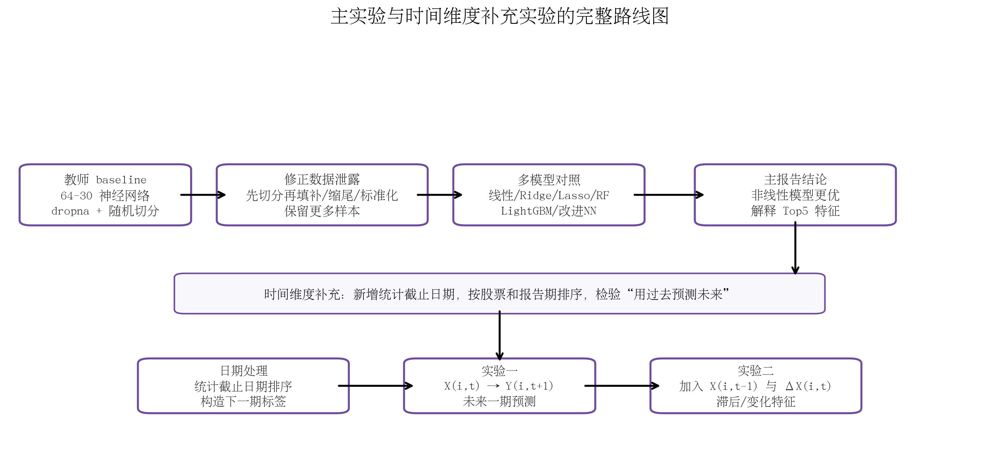
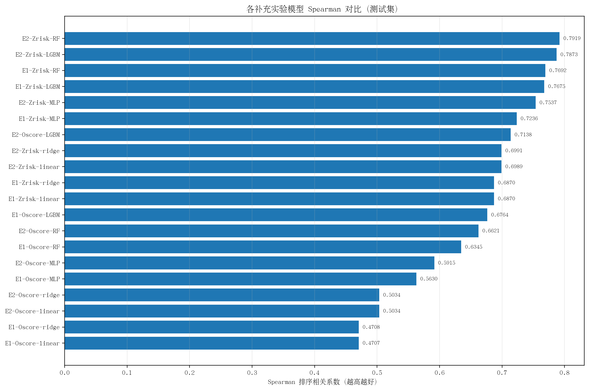
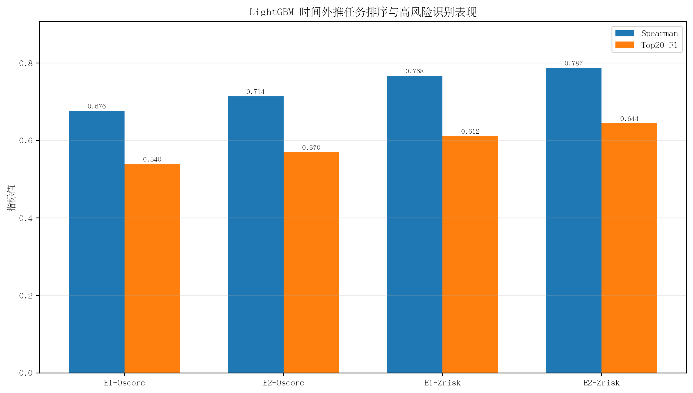
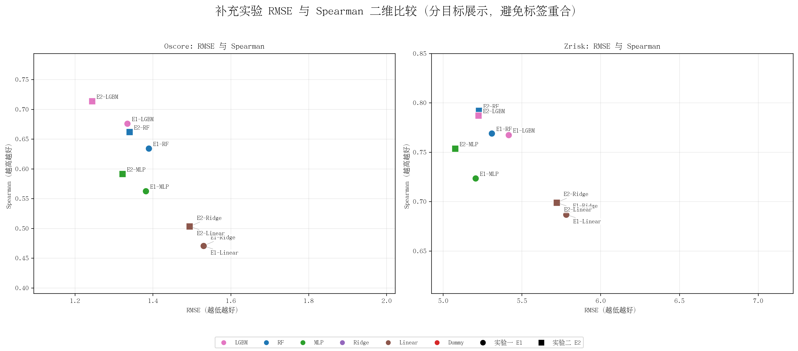

# A 股上市公司财务困境风险预测：时间维度补充实验报告

> 本报告是对主仓库中随机切分主实验的补充，重点利用新增的 `统计截止日期` 字段，把任务从“同期风险拟合”扩展为“未来一期财务风险预测”。本文件采用 GitHub Markdown 数学公式格式：行内公式使用 `$...$`，独立公式使用 `$$...$$`。

## 1. 补充实验目的

主实验已经完成无泄漏预处理、多模型对照、神经网络改进和 Zrisk 稳健性检验。随机切分能够评价模型在同一总体分布中的拟合能力，但真实财务风险预警更接近时间外推：投资者、债权人或企业管理者只能使用当前和过去已经披露的信息，预测未来一期风险。

因此，补充实验围绕两个问题展开：

1. 仅使用第 $t$ 期财务指标，能否预测同一股票第 $t+1$ 期的风险指标？
2. 加入上一期水平 $X_{i,t-1}$ 和当期变化量 $\Delta X_{i,t}$ 后，模型能否更好识别未来高风险公司？

## 2. 数据与时间切分

本补充实验仍使用教师提供的 A 股上市公司财务指标数据，未额外引入外部数据。新增字段为 `统计截止日期`，用于同一股票内部排序、构造下一期标签和时间切分。

日期数据概况：


|   总样本数 |   股票数 |   行业数 | 起始日期   | 结束日期   |   季度数 |   Oscore非缺失 |   Zrisk非缺失 |
|-----------:|---------:|---------:|:-----------|:-----------|---------:|---------------:|--------------:|
|     201022 |     5551 |       86 | 2003-03-31 | 2025-03-31 |       89 |         188193 |        200103 |

运行配置摘要：

```json
{
  "input": "数据(2026.5 含日期).csv",
  "output_dir": "outputs/time_supplement",
  "targets": [
    "Oscore",
    "Zrisk"
  ],
  "date_col": "统计截止日期",
  "train_end": "2020-12-31",
  "valid_end": "2022-12-31",
  "random_state": 42,
  "n_jobs": -1,
  "sample_train_rows": null,
  "rf_n_estimators": 120,
  "rf_max_depth": 12,
  "rf_min_samples_leaf": 20,
  "lgbm_n_estimators": 200,
  "lgbm_learning_rate": 0.05,
  "lgbm_num_leaves": 31,
  "models": [
    "dummy_mean",
    "linear",
    "ridge",
    "random_forest",
    "lightgbm"
  ],
  "include_nn": true,
  "nn_max_iter": 60,
  "nn_batch_size": 1024,
  "nn_lr": 0.0003,
  "nn_alpha": 1e-05,
  "has_lightgbm": true
}
```


时间切分规则为：训练集截至 `2020-12-31`，验证集截至 `2022-12-31`，之后样本作为测试集。所有填补、缩尾、偏态变换、标准化和 One-Hot 编码参数均只在训练集拟合。


## 3. 被解释变量与特征构造

Oscore 作为主风险指标；Zrisk 作为稳健性指标，定义为：

$$
Zrisk_i = -Zscore_i
$$

未来一期预测目标为：

$$
X_{i,t} \longrightarrow Y_{i,t+1}
$$

其中：

$$
Y_{i,t+1}^{Oscore} = Oscore_{i,t+1}, \qquad
Y_{i,t+1}^{Zrisk} = Zrisk_{i,t+1}
$$

实验二进一步加入滞后特征和变化特征：

$$
\Delta X_{i,t} = X_{i,t} - X_{i,t-1}
$$

因此实验二的输入可以写为：

$$
\left[X_{i,t},\;X_{i,t-1},\;\Delta X_{i,t}\right] \longrightarrow Y_{i,t+1}
$$

## 4. 无泄漏预处理公式

训练集标准化公式为：

$$
\widetilde{x}_{ij} = \frac{x_{ij} - \mu_j^{train}}{\sigma_j^{train}}
$$

缩尾处理只使用训练集分位数：

$$
x_{ij}^{\star} = \min\left(\max\left(x_{ij}, q_{j,0.01}^{train}\right), q_{j,0.99}^{train}\right)
$$

对严重偏态财务变量使用符号对数变换：

$$
\operatorname{slog}(x) = \operatorname{sign}(x) \cdot \log(1+|x|)
$$

Ridge 线性模型的目标函数为：

$$
\min_{\beta} \sum_{i=1}^{n} \left(y_i - \beta_0 - X_i\beta\right)^2 + \lambda\sum_{j=1}^{p} \beta_j^2
$$

## 5. 评价指标

RMSE、MAE、$R^2$、Pearson 和 Spearman 用于评价连续预测误差、解释能力和排序能力：

$$
RMSE = \sqrt{\frac{1}{n}\sum_{i=1}^{n}(y_i-\hat{y}_i)^2}
$$

$$
MAE = \frac{1}{n}\sum_{i=1}^{n}|y_i-\hat{y}_i|
$$

$$
R^2 = 1 - \frac{\sum_{i=1}^{n}(y_i-\hat{y}_i)^2}{\sum_{i=1}^{n}(y_i-\bar{y})^2}
$$

Top20 F1 将真实风险最高的 20% 样本视为真实高风险组，并考察模型预测出的前 20% 高风险公司与真实高风险公司是否重合：

$$
F1_{Top20} = \frac{2 \cdot Precision_{Top20} \cdot Recall_{Top20}}{Precision_{Top20}+Recall_{Top20}}
$$

## 6. 实验路线图




## 7. 测试集结果总表

| experiment             | target   | model       |   n_train |   n_test |   n_features |   RMSE |    MAE |      R2 | Pearson   | Spearman   |   Top20_F1 |
|:-----------------------|:---------|:------------|----------:|---------:|-------------:|-------:|-------:|--------:|:----------|:-----------|-----------:|
| 实验一：未来一期预测   | Oscore   | LightGBM    |    119618 |    28849 |          100 | 1.3344 | 0.9718 |  0.2538 | 0.6116    | 0.6764     |     0.5395 |
| 实验一：未来一期预测   | Oscore   | 随机森林    |    119618 |    28849 |          100 | 1.3893 | 1.053  |  0.1912 | 0.6086    | 0.6345     |     0.4977 |
| 实验一：未来一期预测   | Oscore   | MLP(128-64) |    119618 |    28849 |          100 | 1.3818 | 1.0524 |  0.1999 | 0.5689    | 0.5630     |     0.4402 |
| 实验一：未来一期预测   | Oscore   | Ridge       |    119618 |    28849 |          100 | 1.5296 | 1.1782 |  0.0195 | 0.4775    | 0.4708     |     0.3759 |
| 实验一：未来一期预测   | Oscore   | 线性回归    |    119618 |    28849 |          100 | 1.5298 | 1.1783 |  0.0193 | 0.4773    | 0.4707     |     0.3759 |
| 实验一：未来一期预测   | Oscore   | 均值基准    |    119618 |    28849 |          100 | 1.6723 | 1.2811 | -0.172  |           |            |     0.1596 |
| 实验二：滞后与变化特征 | Oscore   | LightGBM    |    111715 |    27454 |          138 | 1.2437 | 0.9296 |  0.3437 | 0.6799    | 0.7138     |     0.5702 |
| 实验二：滞后与变化特征 | Oscore   | 随机森林    |    111715 |    27454 |          138 | 1.3402 | 1.0134 |  0.2379 | 0.6375    | 0.6621     |     0.5185 |
| 实验二：滞后与变化特征 | Oscore   | MLP(128-64) |    111715 |    27454 |          138 | 1.3217 | 1.0116 |  0.2588 | 0.6050    | 0.5915     |     0.4544 |
| 实验二：滞后与变化特征 | Oscore   | Ridge       |    111715 |    27454 |          138 | 1.4942 | 1.151  |  0.0526 | 0.5101    | 0.5034     |     0.3954 |
| 实验二：滞后与变化特征 | Oscore   | 线性回归    |    111715 |    27454 |          138 | 1.4944 | 1.1511 |  0.0524 | 0.5100    | 0.5034     |     0.3956 |
| 实验二：滞后与变化特征 | Oscore   | 均值基准    |    111715 |    27454 |          138 | 1.6604 | 1.2707 | -0.1698 |           |            |     0.1563 |
| 实验一：未来一期预测   | Zrisk    | 随机森林    |    125073 |    29514 |          100 | 5.309  | 2.1541 |  0.4031 | 0.6609    | 0.7692     |     0.6173 |
| 实验一：未来一期预测   | Zrisk    | LightGBM    |    125073 |    29514 |          100 | 5.4159 | 2.1845 |  0.3788 | 0.6296    | 0.7675     |     0.6117 |
| 实验一：未来一期预测   | Zrisk    | MLP(128-64) |    125073 |    29514 |          100 | 5.2059 | 2.2423 |  0.426  | 0.6650    | 0.7236     |     0.5606 |
| 实验一：未来一期预测   | Zrisk    | Ridge       |    125073 |    29514 |          100 | 5.7786 | 2.9889 |  0.2928 | 0.5748    | 0.6870     |     0.5641 |
| 实验一：未来一期预测   | Zrisk    | 线性回归    |    125073 |    29514 |          100 | 5.7803 | 2.9908 |  0.2924 | 0.5746    | 0.6870     |     0.5645 |
| 实验一：未来一期预测   | Zrisk    | 均值基准    |    125073 |    29514 |          100 | 6.8719 | 3.5826 | -0.0001 |           |            |     0.1154 |
| 实验二：滞后与变化特征 | Zrisk    | 随机森林    |    114407 |    27798 |          139 | 5.227  | 2.1284 |  0.4196 | 0.6766    | 0.7919     |     0.6495 |
| 实验二：滞后与变化特征 | Zrisk    | LightGBM    |    114407 |    27798 |          139 | 5.2251 | 2.147  |  0.42   | 0.6689    | 0.7873     |     0.6444 |
| 实验二：滞后与变化特征 | Zrisk    | MLP(128-64) |    114407 |    27798 |          139 | 5.0762 | 2.2168 |  0.4526 | 0.6900    | 0.7537     |     0.5888 |
| 实验二：滞后与变化特征 | Zrisk    | Ridge       |    114407 |    27798 |          139 | 5.7191 | 3.0654 |  0.3051 | 0.5922    | 0.6991     |     0.5703 |
| 实验二：滞后与变化特征 | Zrisk    | 线性回归    |    114407 |    27798 |          139 | 5.722  | 3.0688 |  0.3045 | 0.5919    | 0.6989     |     0.5703 |
| 实验二：滞后与变化特征 | Zrisk    | 均值基准    |    114407 |    27798 |          139 | 6.8621 | 3.5923 | -0.0004 |           |            |     0.1099 |


## 8. 关键结果解读

- 实验一 / Oscore: Spearman 最高模型为 `lightgbm`（Spearman=0.6764）；Top20 F1 最高模型为 `lightgbm`（Top20 F1=0.5395）。
- 实验一 / Zrisk: Spearman 最高模型为 `random_forest`（Spearman=0.7692）；Top20 F1 最高模型为 `random_forest`（Top20 F1=0.6173）。
- 实验二 / Oscore: Spearman 最高模型为 `lightgbm`（Spearman=0.7138）；Top20 F1 最高模型为 `lightgbm`（Top20 F1=0.5702）。
- 实验二 / Zrisk: Spearman 最高模型为 `random_forest`（Spearman=0.7919）；Top20 F1 最高模型为 `random_forest`（Top20 F1=0.6495）。

LightGBM 在实验一和实验二之间的变化如下：

| target   | metric   |   实验一 |   实验二 |   实验二-实验一 | 方向     |
|:---------|:---------|---------:|---------:|----------------:|:---------|
| Oscore   | RMSE     |   1.3344 |   1.2437 |         -0.0907 | 越低越好 |
| Oscore   | R2       |   0.2538 |   0.3437 |          0.0898 | 越高越好 |
| Oscore   | Spearman |   0.6764 |   0.7138 |          0.0375 | 越高越好 |
| Oscore   | Top20_F1 |   0.5395 |   0.5702 |          0.0307 | 越高越好 |
| Zrisk    | RMSE     |   5.4159 |   5.2251 |         -0.1908 | 越低越好 |
| Zrisk    | R2       |   0.3788 |   0.42   |          0.0412 | 越高越好 |
| Zrisk    | Spearman |   0.7675 |   0.7873 |          0.0197 | 越高越好 |
| Zrisk    | Top20_F1 |   0.6117 |   0.6444 |          0.0327 | 越高越好 |


从 Oscore 结果看，加入滞后与变化特征后，LightGBM 的 RMSE 从 1.3344 降至 1.2437，Spearman 从 0.6764 提高到 0.7138，Top20 F1 从 0.5395 提高到 0.5702，说明动态特征对未来一期 Oscore 预测具有明显增益。

从 Zrisk 结果看，LightGBM 的 Spearman 从 0.7675 提高到 0.7873，Top20 F1 从 0.6117 提高到 0.6444，说明动态特征同样有助于稳健性目标下的高风险识别。


## 9. 结果图








## 10. 完整特征名称位置

为避免报告正文过长，完整特征名称以 CSV 形式保存在以下路径：

- `results/time_supplement/experiments/experiment1_lead1_basic/oscore/feature_names.csv`
- `results/time_supplement/experiments/experiment1_lead1_basic/zrisk/feature_names.csv`
- `results/time_supplement/experiments/experiment2_lead1_lag_change/oscore/feature_names.csv`
- `results/time_supplement/experiments/experiment2_lead1_lag_change/zrisk/feature_names.csv`

其中，实验一主要包括当前期财务指标、缺失指示变量、行业 One-Hot 和报表类型编码；实验二在此基础上加入上一期水平和变化量特征。


## 11. GitHub 复现实验命令

将含统计日期的真实数据放入 `data/raw/` 后，可以运行：

```bash
python scripts/time_supplement_experiments.py \
  --input data/raw/financial_data_with_date.csv \
  --output_dir outputs/time_supplement \
  --targets Oscore Zrisk \
  --include_nn \
  --models dummy_mean linear ridge random_forest lightgbm mlp_128_64
```

其中 `data/raw/`、`outputs/` 和 `models/` 通常不建议上传到 GitHub。该包只保留了汇总结果、模型指标、预处理摘要和特征名称，不包含原始数据、训练后模型文件和完整逐样本预测结果。


## 12. 结论

时间维度补充实验表明，新增 `统计截止日期` 后，原本偏静态的财务风险拟合任务可以扩展为更接近真实应用场景的动态风险预警任务。非线性模型在 Oscore 和 Zrisk 的未来一期预测中总体优于线性模型；加入滞后水平和变化特征后，模型的排序能力和 Top20 高风险识别能力进一步提升。这与主报告关于“财务困境风险由盈利能力、现金流质量、偿债能力、经营质量和市场预期共同作用，且存在非线性关系”的结论保持一致。
