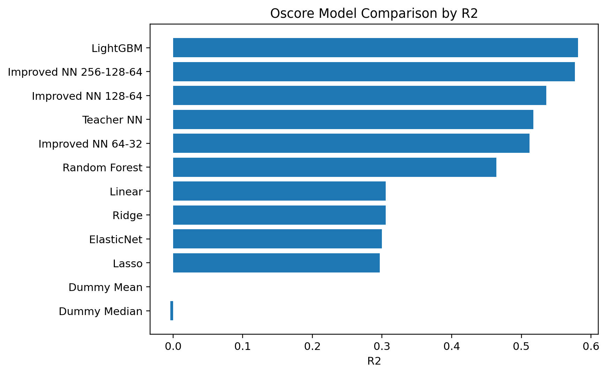
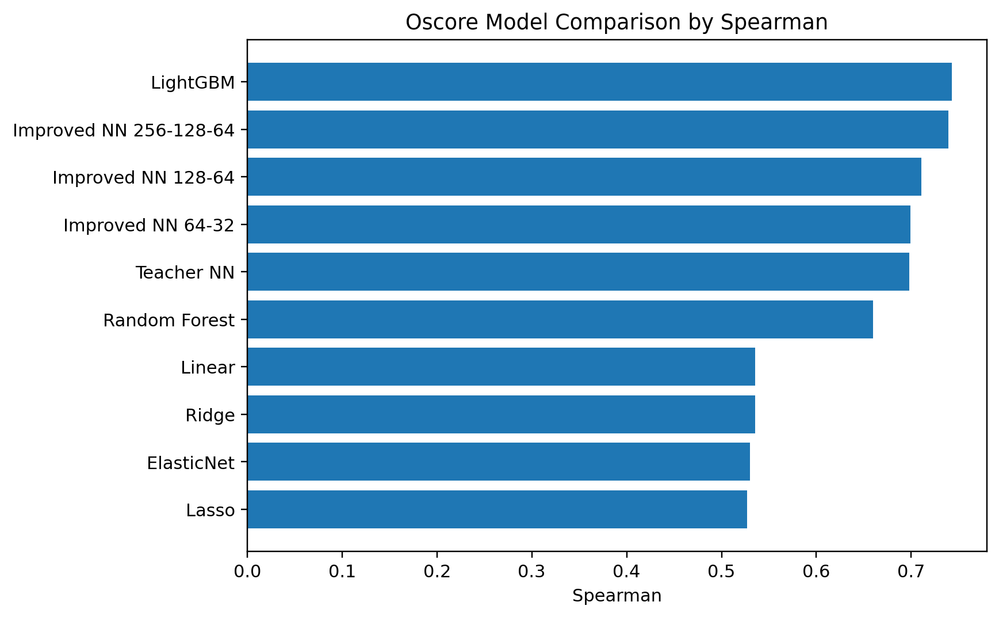
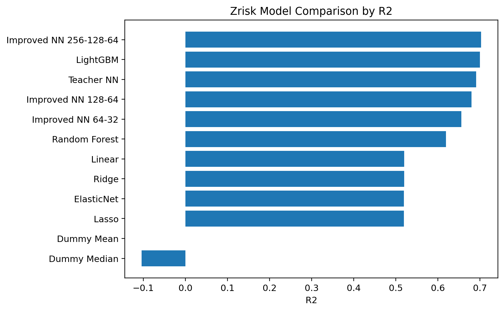
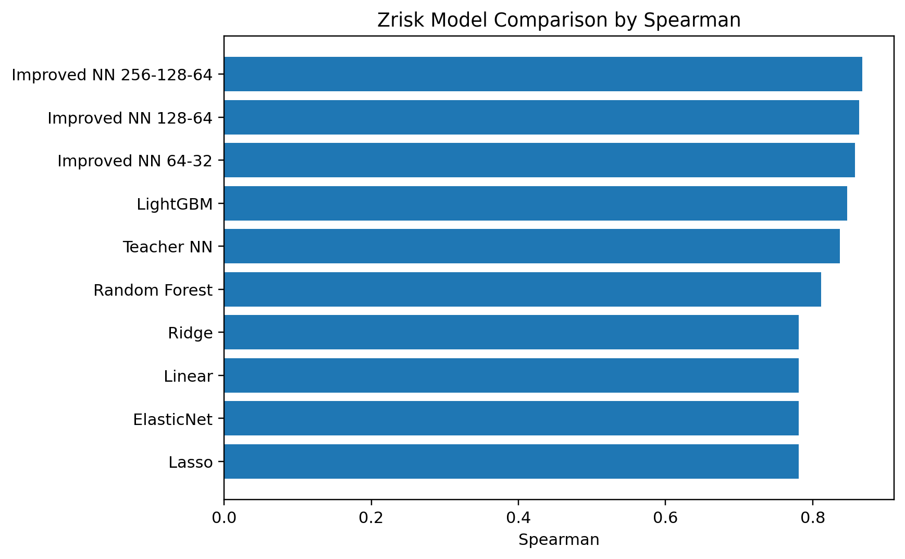

# 基于神经网络的 A 股上市公司财务困境风险预测研究 
———— 兼论多类机器学习模型的对比

## 摘要

本文基于一份 A 股上市公司财务指标数据，围绕 **Oscore 财务困境风险指标** 构建回归预测模型，并进一步以 **Zrisk = -Zscore** 作为替代被解释变量进行稳健性检验。由于原始数据未提供具体统计截止日期，难以按公司—报告期准确匹配外部补充数据，本文将研究重点放在原始财务指标数据的规范化处理、基准神经网络复现与修正、多模型对照实验、模型解释和财务分析上。

根据研究任务，本文首先复现一个基础神经网络 baseline，并在此基础上优化数据预处理与模型训练流程。为了更客观地评价神经网络模型的预测效果，本文设置线性回归、Ridge、Lasso、ElasticNet、随机森林和 LightGBM 等模型作为对照，从而比较不同模型在财务风险预测任务中的表现差异。

主实验结果表明，LightGBM 在 Oscore 任务中综合表现最佳，测试集 RMSE 为 **1.0048**、MAE 为 **0.7892**、R² 为 **0.5814**、Spearman 为 **0.7427**；改进神经网络 256-128-64 的表现非常接近，测试集 RMSE 为 **1.0103**、R² 为 **0.5768**、Spearman 为 **0.7392**。Zrisk 稳健性实验中，改进神经网络 256-128-64 取得最佳表现，测试集 R² 为 **0.7021**、Spearman 为 **0.8671**；LightGBM 的 R² 为 **0.6997**、Spearman 为 **0.8469**，二者仍位于前列。

进一步的特征重要性和分组分析显示，销售 EVA 率、现金流到期债务保障倍数、净利润现金净含量、EVA 率、托宾 Q 和营运指数等变量对风险得分具有重要解释力。主实验和稳健性实验共同说明，公司财务困境风险与财务指标之间存在显著的非线性关系和变量交互，非线性模型比单纯线性模型更适合该类表格型财务风险识别任务。

**关键词：** Oscore；Zrisk；Zscore；财务困境风险；神经网络；LightGBM；公司理财；稳健性检验；特征重要性

## 1. 引言

公司理财研究关注企业如何通过投资决策、融资决策、营运资本管理和风险管理实现企业价值最大化。财务困境风险是公司理财中的核心问题之一。当企业盈利能力下降、现金流不足或债务负担过重时，企业不仅会面临较高融资成本，还可能出现债务违约、投资收缩、破产成本上升和股东价值受损等后果。因此，如何利用财务指标识别公司风险，是公司理财和财务分析中的重要问题。

原始基准代码提供了使用神经网络进行公司财务指标回归的基础框架，但从数据审计和复现实验看，原始流程存在两个主要不足：第一，直接删除所有含缺失值的样本会导致大量有效观测被丢弃；第二，如果在划分训练集和测试集之前就对全样本进行标准化，测试集的特征分布信息会提前进入模型训练流程，造成数据泄露。本文在基准模型基础上进行系统优化：一方面改进缺失值、异常值和标准化处理，另一方面引入传统机器学习模型和改进神经网络进行对照。

本文的任务不是严格意义上的未来违约预测，而是基于现有公司财务特征对财务困境风险得分进行拟合、识别和解释。由于原始数据没有提供具体统计截止日期，无法构造滞后变量，也难以找到补充数据按公司—报告期严格匹配，为避免错误匹配引入新的偏差，本文最终只使用原始财务指标数据进行建模。

## 2. 被解释变量选择与财务理论基础

### 2.1 Oscore 的财务含义

本文选择 Oscore 作为主被解释变量，主要原因在于本文的研究目标是预测上市公司的“财务困境风险”，而 Oscore 本身就是围绕企业陷入财务困境的可能性构造的综合风险指标。在解释方向上，Oscore 越高，通常表示企业财务困境风险越高；Oscore 越低，则说明企业财务状况相对稳健。因此，将 Oscore 作为主目标变量，可以使模型预测结果直接解释为公司风险水平的高低。

$$
\mathrm{Oscore}_i=f(\mathrm{Size}_i,\mathrm{Leverage}_i,\mathrm{WorkingCapital}_i,\mathrm{Profitability}_i,\mathrm{CashFlowCoverage}_i,\ldots)
$$

相较于单一的 ROA、ROE 或营业利润增长率，Oscore 更符合公司理财中的综合风险观。企业财务困境往往不是由单个指标决定，而是由盈利能力、资本结构、现金流质量、市场预期和行业特征共同作用。例如，高利润但现金流质量差的公司仍可能陷入偿债压力；低杠杆但盈利持续恶化的公司也可能出现风险。因此，以 Oscore 作为主目标变量，有助于将多维风险压缩为一个可回归的连续得分。

### 2.2 Zrisk 的稳健性含义

原始数据中还包含 Zscore。Zscore 同样用于刻画公司财务安全状况，但其方向通常与 Oscore 相反：Zscore 越高，企业越安全；Zscore 越低，企业越接近财务困境。为了使稳健性检验的解释方向与 Oscore 保持一致，本文定义 Zrisk 为 Zscore 的相反数。

$$
\mathrm{Zrisk}_i=-\mathrm{Zscore}_i
$$

这样处理后，Zrisk 越高同样表示财务风险越高。若模型在 Oscore 和 Zrisk 两个风险指标下都表现出相似结论，例如非线性模型均明显优于线性模型，且 LightGBM 或改进神经网络均位于前列，则说明本文结论不依赖于单一风险指标，具有一定稳健性。

## 3. 数据来源与数据审计

### 3.1 样本结构与切分

原始数据共 201,022 行、18 列，包含股票代码、股票简称、行业名称、报表类型以及若干公司财务指标。其中可选被解释变量包括 Oscore 和 Zscore，分类变量包括行业名称和报表类型。本文在删除被解释变量缺失样本后，将样本按照约 70% / 15% / 15% 划分为训练集、验证集和测试集。

| 实验目标 | 样本集 | 样本数 | 特征数 | Y均值 | Y标准差 | Y最小值 | Y中位数 | Y最大值 | 股票数 | 行业数 |
|---|---:|---:|---:|---:|---:|---:|---:|---:|---:|---:|
| Oscore | train | 131735 | 102 | -8.3339 | 1.5517 | -12.7291 | -8.2411 | -4.8990 | 5374 | 86 |
| Oscore | valid | 28229 | 102 | -8.3357 | 1.5534 | -12.7291 | -8.2411 | -4.8990 | 4860 | 84 |
| Oscore | test | 28229 | 102 | -8.3353 | 1.5531 | -12.7291 | -8.2411 | -4.8990 | 4866 | 85 |
| Zrisk | train | 140072 | 102 | -4.5404 | 5.5577 | -35.7621 | -2.7454 | -0.1993 | 5483 | 85 |
| Zrisk | valid | 30015 | 102 | -4.5318 | 5.5291 | -35.7621 | -2.7455 | -0.1993 | 5024 | 85 |
| Zrisk | test | 30016 | 102 | -4.5289 | 5.5392 | -35.7621 | -2.7453 | -0.1993 | 5068 | 85 |

训练集、验证集和测试集在目标变量均值、中位数和标准差上较为接近，说明随机切分后目标变量分布比较平衡。由于 Zrisk 与 Oscore 的分布范围不同，二者的 RMSE 和 MAE 不能直接横向比较，因此稳健性检验更关注 R²、Spearman 和 Top20 Precision/Recall/F1。

### 3.2 缺失值和异常值

财务数据中的缺失值并不一定是完全随机产生的。例如，不分红企业可能缺失现金股利保障倍数，现金流异常或债务结构特殊的企业可能在部分偿债指标上缺失。因此，简单删除所有缺失样本可能导致样本选择偏差。本文将解释变量缺失分为低缺失、中等缺失、高缺失和超高缺失，并采取不同策略。

| 变量 | 训练集缺失率 | 缺失类别 | 是否保留 | 处理方式 |
|---|---:|---|---|---|
| 托宾 Q 值 A | 0.00% | 低缺失 | 是 | 保留原始数据 |
| EVA 率口径一 | 0.07% | 低缺失 | 是 | 全训练集中位数填补 |
| 销售 EVA 率口径一 | 0.12% | 低缺失 | 是 | 全训练集中位数填补 |
| 现金流到期债务保障倍数 | 14.02% | 中等缺失 | 是 | 行业中位数填补 + 缺失指示变量 |
| 净资产收益率增长率 A | 9.77% | 中等缺失 | 是 | 行业中位数填补 + 缺失指示变量 |
| 营业利润增长率 A | 11.23% | 中等缺失 | 是 | 行业中位数填补 + 缺失指示变量 |
| 现金股利保障倍数 | 80.45% | 超高缺失 | 否 | 主模型删除 |

公司财务指标还常具有极端值。例如，现金流覆盖倍数、增长率、市盈率和营运指数可能因为分母接近 0、企业亏损或经营波动而异常放大。若不处理这些极端值，线性模型和神经网络可能被少数极端样本过度影响。本文采用训练集 1% 和 99% 分位数缩尾，并对严重偏态变量进行符号对数变换。

## 4. 数据预处理与无泄漏建模流程

### 4.1 无泄漏预处理

标准化是机器学习中常用的处理步骤，目的是把不同量纲的变量转化到相近尺度。例如，资产规模、现金流倍数、增长率和市盈率的数值范围差异很大，若直接进入模型，某些大尺度变量可能不恰当地支配训练过程。标准化通常写为：

$$
z_{ij}=\frac{x_{ij}-\mu_j^{\mathrm{train}}}{\sigma_j^{\mathrm{train}}}
$$

其中，$\mu_j^{\mathrm{train}}$  和  $\sigma_j^{\mathrm{train}}$ 分别表示第 $j$ 个变量在训练集中的均值和标准差。关键点在于：这两个参数只能由训练集估计，不能由全样本估计。如果先用全部样本计算均值和标准差，再划分训练集和测试集，测试集的分布信息就提前进入了模型训练流程，即数据泄露。

### 4.2 缺失填补、缩尾和偏态变换

对于被解释变量，缺失样本直接删除，因为监督学习必须有真实标签；若人为填补 Oscore 或 Zscore，相当于制造虚假的训练标签。对于解释变量，低缺失变量使用训练集中位数填补，中等缺失变量使用训练集行业中位数填补并加入缺失指示变量，超高缺失变量在主模型中删除。

训练集分位数缩尾定义为：

$$
\widetilde{x}_{ij}=\min\left(\max(x_{ij},q^{\mathrm{train}}_{0.01,j}),q^{\mathrm{train}}_{0.99,j}\right)
$$

对于可能为负且分布严重偏态的财务变量，本文使用符号对数变换：

$$
x'_{ij}={sign}(x_{ij})\log(1+|x_{ij}|)
$$

行业名称和报表类型等分类变量通过 One-Hot 编码进入模型，即为每个行业生成一个 0/1 变量：

$$
D_{ik}=\begin{cases}
1, & \text{若公司 }i\text{ 属于行业 }k\\
0, & \text{否则}
\end{cases}
$$

## 5. 模型设计与评价指标

### 5.1 对照模型

本文将模型分为四类。第一类是 Dummy 模型，即始终预测训练集均值或中位数，用作最低基准。第二类是线性模型和正则化线性模型，包括线性回归、Ridge、Lasso 和 ElasticNet。第三类是树模型，包括随机森林和 LightGBM。第四类是神经网络模型，包括基准神经网络和改进神经网络。

线性回归假设风险得分与财务变量之间近似满足加总线性关系：

$$
\hat{y}_i=\beta_0+\sum_{j=1}^{p}\beta_jx_{ij}
$$

Ridge 和 Lasso 在普通线性回归基础上加入正则化项。Ridge 使用系数平方和惩罚，适合缓解多重共线性；Lasso 使用系数绝对值惩罚，部分变量系数可能被压缩为 0，因此具有一定变量筛选效果。

$$
\min_{\beta}\sum_{i=1}^{n}(y_i-\hat{y}_i)^2+\lambda\sum_{j=1}^{p}\beta_j^2
$$

$$
\min_{\beta}\sum_{i=1}^{n}(y_i-\hat{y}_i)^2+\lambda\sum_{j=1}^{p}|\beta_j|
$$

神经网络可以理解为多层非线性函数逼近器。单层隐藏层可简化表示为：

$$
h_i=\mathrm{ReLU}(W_1x_i+b_1),\qquad \hat{y}_i=W_2h_i+b_2
$$

改进神经网络在基准结构基础上加入 Batch Normalization、Dropout、EarlyStopping、AdamW 权重衰减和学习率调度，以提高训练稳定性并缓解过拟合。

### 5.2 评价指标

本文从误差大小、解释能力、排序能力和高风险识别能力四个角度评价模型。

$$
\mathrm{RMSE}=\sqrt{\frac{1}{n}\sum_{i=1}^{n}(y_i-\hat{y}_i)^2}
$$

$$
\mathrm{MAE}=\frac{1}{n}\sum_{i=1}^{n}|y_i-\hat{y}_i|
$$

$$
R^2=1-\frac{\sum_{i=1}^{n}(y_i-\hat{y}_i)^2}{\sum_{i=1}^{n}(y_i-\bar{y})^2}
$$

Pearson 衡量预测值与真实值之间的线性相关性，Spearman 衡量排序相关性。在财务风险预警场景中，排序能力尤为重要，因为实际应用中常常更关心模型能否把高风险公司排在前面。

由于本文原任务为连续风险得分回归，模型输出的是 Oscore 或 Zrisk 的预测值，而不是“高风险/非高风险”的离散类别。因此，传统分类意义上的准确率、召回率和 F1 不能直接计算。本文将真实风险得分最高的 20% 样本定义为真实高风险组，将模型预测风险最高的 20% 样本定义为模型识别出的高风险组，并据此计算 Top20 Precision、Top20 Recall 和 Top20 F1。

$$
\mathrm{Precision@20\%}=\frac{|\widehat{H}_{20}\cap H_{20}|}{|\widehat{H}_{20}|},\qquad
\mathrm{Recall@20\%}=\frac{|\widehat{H}_{20}\cap H_{20}|}{|H_{20}|}
$$

$$
\mathrm{F1@20\%}=\frac{2\times \mathrm{Precision@20\%}\times \mathrm{Recall@20\%}}{\mathrm{Precision@20\%}+\mathrm{Recall@20\%}}
$$

## 6. Oscore 主实验结果

### 6.1 传统模型与神经网络表现

| 模型 | RMSE | MAE | R² | Pearson | Spearman | Top20 Precision | Top20 Recall | Top20 F1 |
|---|---:|---:|---:|---:|---:|---:|---:|---:|
| LightGBM | 1.0048 | 0.7892 | 0.5814 | 0.7637 | 0.7427 | 0.5809 | 0.5809 | 0.5809 |
| 改进 NN (256-128-64) | 1.0103 | 0.7878 | 0.5768 | 0.7596 | 0.7392 | 0.5767 | 0.5767 | 0.5767 |
| 改进 NN (128-64) | 1.0579 | 0.8291 | 0.5360 | 0.7330 | 0.7108 | 0.5505 | 0.5505 | 0.5505 |
| 基准 NN | 1.0792 | 0.8495 | 0.5172 | 0.7196 | 0.6977 | 0.5430 | 0.5430 | 0.5430 |
| 改进 NN (64-32) | 1.0851 | 0.8541 | 0.5118 | 0.7218 | 0.6991 | 0.5425 | 0.5425 | 0.5425 |
| 随机森林 | 1.1370 | 0.8981 | 0.4641 | 0.6837 | 0.6597 | 0.5218 | 0.5218 | 0.5218 |
| 线性回归 | 1.2945 | 1.0258 | 0.3053 | 0.5525 | 0.5355 | 0.4090 | 0.4090 | 0.4090 |
| Ridge | 1.2945 | 1.0258 | 0.3053 | 0.5525 | 0.5354 | 0.4088 | 0.4088 | 0.4088 |
| ElasticNet | 1.2996 | 1.0305 | 0.2998 | 0.5476 | 0.5298 | 0.4026 | 0.4026 | 0.4026 |
| Lasso | 1.3023 | 1.0329 | 0.2969 | 0.5449 | 0.5268 | 0.4033 | 0.4033 | 0.4033 |

综合 RMSE、MAE、R²、Pearson、Spearman 和 Top20 F1，LightGBM 排名第一，改进神经网络 256-128-64 排名第二。两者差距非常小，说明在当前表格型财务数据上，LightGBM 具有效率和精度优势，但改进神经网络同样能够接近最佳结果。

### 6.2 结果解释

线性回归、Ridge、Lasso 和 ElasticNet 的 R² 约为 0.30，Spearman 约为 0.53；随机森林提升到 R²=0.4641、Spearman=0.6597；LightGBM 进一步提升到 R²=0.5814、Spearman=0.7427。该结果说明，公司财务困境风险与财务变量之间并非简单线性关系，而存在明显的非线性组合和变量交互。

## 7. Zrisk 稳健性检验

### 7.1 各模型表现

| 模型 | RMSE | MAE | R² | Pearson | Spearman | Top20 Precision | Top20 Recall | Top20 F1 |
|---|---:|---:|---:|---:|---:|---:|---:|---:|
| 改进 NN (256-128-64) | 3.0242 | 1.6780 | 0.7021 | 0.8422 | 0.8671 | 0.7095 | 0.7095 | 0.7095 |
| LightGBM | 3.0361 | 1.6998 | 0.6997 | 0.8400 | 0.8469 | 0.6802 | 0.6802 | 0.6802 |
| 基准 NN | 3.1711 | 1.7099 | 0.6724 | 0.8207 | 0.8483 | 0.6644 | 0.6644 | 0.6644 |
| 改进 NN (128-64) | 3.1976 | 1.7286 | 0.6669 | 0.8176 | 0.8461 | 0.7065 | 0.7065 | 0.7065 |
| 改进 NN (64-32) | 3.3283 | 1.8293 | 0.6391 | 0.8007 | 0.8384 | 0.6965 | 0.6965 | 0.6965 |
| 随机森林 | 3.8999 | 2.3697 | 0.5046 | 0.7198 | 0.7445 | 0.6442 | 0.6442 | 0.6442 |
| 线性回归 | 4.2654 | 2.9018 | 0.4071 | 0.6381 | 0.6711 | 0.6141 | 0.6141 | 0.6141 |
| Ridge | 4.2653 | 2.9018 | 0.4072 | 0.6381 | 0.6711 | 0.6146 | 0.6146 | 0.6146 |
| ElasticNet | 4.2686 | 2.9078 | 0.4063 | 0.6375 | 0.6711 | 0.6141 | 0.6141 | 0.6141 |
| Lasso | 4.2794 | 2.9258 | 0.4033 | 0.6348 | 0.6687 | 0.6146 | 0.6146 | 0.6146 |

Zrisk 稳健性实验中，改进神经网络 256-128-64 的 R² 和 Spearman 均位于前列，LightGBM 表现非常接近。虽然不同风险指标的具体最优模型略有差异，但非线性模型仍然整体优于线性模型，说明主结论不依赖于单一风险指标。

### 7.2 稳健性结论

Oscore 与 Zrisk 的量纲和分布不同，因此不能直接比较二者 RMSE 或 MAE 的绝对大小。更合理的比较方式是观察 R²、Spearman 和 Top20 F1，以及模型排名是否保持稳定。实验结果显示，在两个风险指标下，LightGBM 和改进神经网络均位于前列，线性模型均明显落后于非线性模型。这说明公司财务困境风险更可能由多个财务变量的非线性组合决定。

## 8. 模型解释与财务分析

### 8.1 重要特征

Oscore 主实验的置换重要性显示，最重要的财务变量包括销售 EVA 率、现金流到期债务保障倍数、净利润现金净含量、EVA 率和营运指数。Zrisk 实验中，托宾 Q、EVA、销售 EVA、现金流到期债务保障倍数等变量也位于重要性前列。

| 变量 | 财务解释 |
|---|---|
| 销售 EVA 率 | 反映单位销售收入创造经济增加值的能力，体现收入质量和价值创造效率。 |
| 现金流到期债务保障倍数 | 衡量经营现金流覆盖到期债务的能力，是偿债能力的重要体现。 |
| 净利润现金净含量 | 反映利润是否有现金流支撑，体现利润质量。 |
| EVA 率 | 衡量企业是否在覆盖资本成本后仍能创造经济价值。 |
| 营运指数 | 体现经营收益向现金流转化的质量，与经营稳定性和现金流质量相关。 |
| 托宾 Q | 反映资本市场对企业未来成长和资产盈利能力的预期。 |

这些变量的共同特点是均与价值创造、偿债能力、现金流质量、盈利质量和市场预期有关，说明模型并非单纯黑箱拟合，而是识别出了具有公司理财含义的核心风险信息。

### 8.2 风险分组分析

按模型预测风险得分从低到高划分 10 组后，如果高预测风险组的真实风险均值也更高，说明模型不仅能够降低平均误差，还能有效识别真实高风险公司。Oscore 主实验中，预测风险组从第 1 组到第 10 组，真实 Oscore 均值整体上升；Zrisk 稳健性实验中也呈现类似趋势。这说明模型具有一定财务风险预警意义。

### 8.3 残差分析

残差分析显示，极端低风险和极端高风险样本的预测误差相对更大。这一现象符合财务风险预测任务特点：极端企业往往具有更强的异常财务状态、行业冲击或经营波动，因此更难被通用模型准确拟合。行业误差分析也表明，不同行业的资本结构、现金流模式和盈利波动不同，会导致模型误差存在行业异质性。

## 9. 局限性与改进方向

本文仍有若干限制。第一，原始数据没有具体统计截止日期，因此本文不能严格声称模型是在预测未来风险，而更准确地说是基于横截面财务特征对风险得分进行拟合、排序和解释。第二，由于无法按报告期准确匹配 Choice 或其他外部数据，本文没有引入市场交易数据、公司治理变量或宏观变量。第三，Oscore 和 Zrisk 都是风险得分，并非真实违约事件，因此模型评价更多反映风险得分拟合能力，而不是实际违约预测能力。

后续研究可以进一步构造公司—季度面板数据，使用滞后一期财务变量预测下一期风险；也可以加入市场收益率、波动率、估值指标、公司治理指标和宏观经济变量，并采用时间切分或滚动窗口验证，以更接近真实金融风险预警场景。

## 10. 结论

本文基于 A 股上市公司财务指标数据，构建了无泄漏的数据预处理和多模型回归预测流程。主实验以 Oscore 为被解释变量，稳健性实验以 Zrisk=-Zscore 为替代风险指标。结果显示，LightGBM 和改进神经网络在两个风险指标下均表现突出，显著优于线性模型，说明公司财务困境风险与财务变量之间存在明显的非线性关系和变量交互。

特征重要性和财务分析进一步表明，模型识别出的核心变量主要集中在 EVA、现金流偿债能力、利润质量、营运质量和市场预期等维度。这与公司理财理论中关于财务困境风险形成机制的解释相一致。整体而言，本文展示了如何将规范机器学习流程与公司理财理论解释结合起来，用于公司财务困境风险的识别和分析。

## 附录说明

- `results/tables/oscore_model_metrics.csv`：Oscore 主实验模型指标。
- `results/tables/zrisk_model_metrics.csv`：Zrisk 稳健性实验模型指标。
- `results/tables/feature_names_report.csv`：最终进入模型的特征名称。
- `src/financial_risk_pipeline.py`：核心建模脚本。
- `data/example/synthetic_financial_data.csv`：合成示例数据，仅用于演示代码运行流程。
